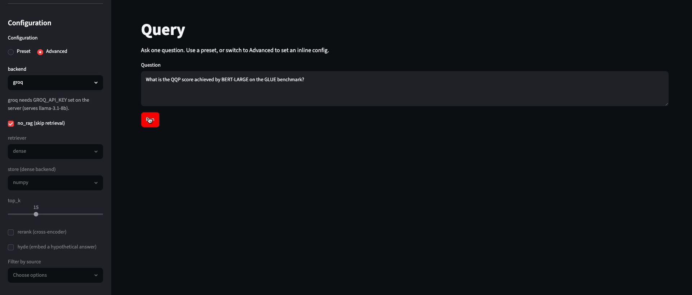
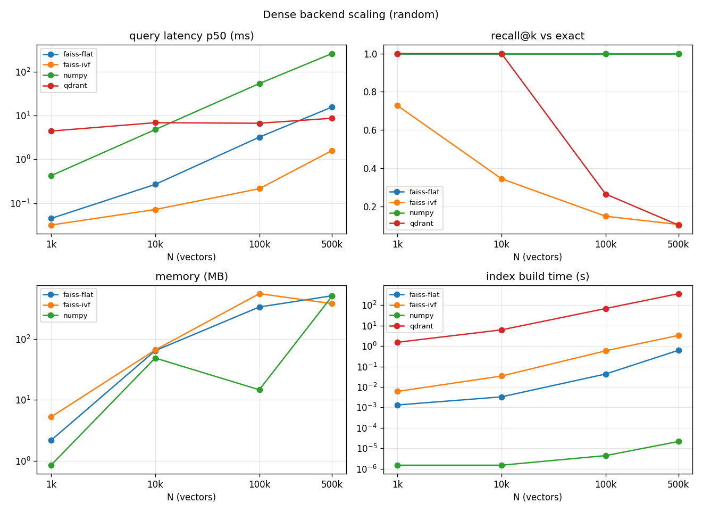
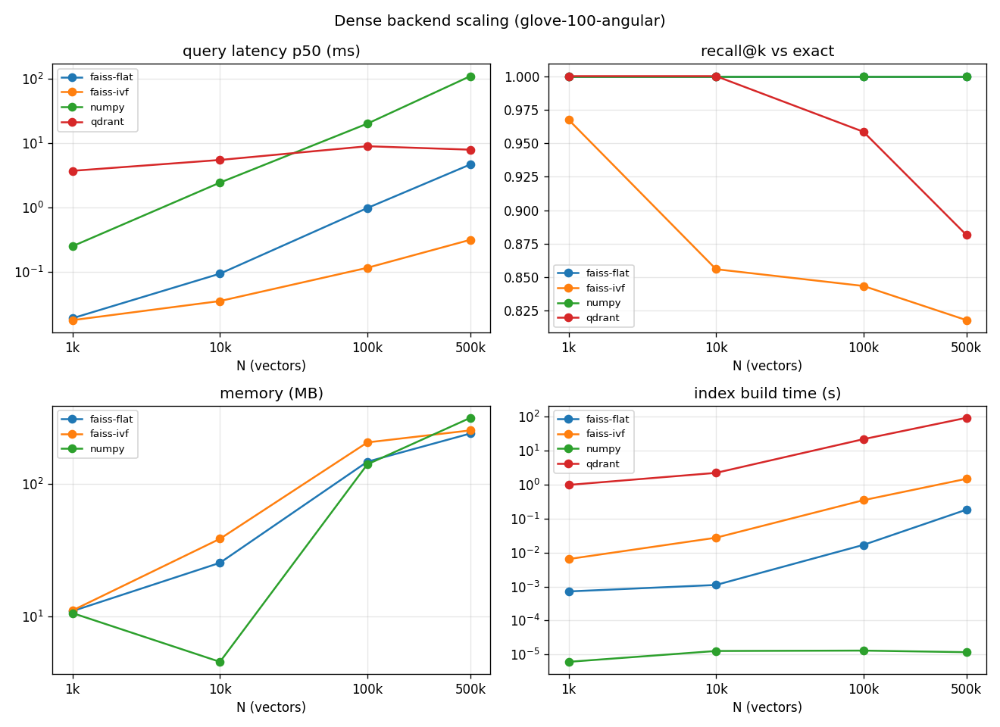

# RAG Pipeline for Academic PDFs

[](https://github.com/antoineschutz/rag-project/actions/workflows/ci.yml)
[](LICENSE)


A from-scratch RAG (Retrieval-Augmented Generation) pipeline: no LangChain, no LlamaIndex. The ingestion is built for academic-PDF layout: two-column reading order, results tables as Markdown, and footnotes. Markdown, text, and DOCX files extract as readable text too.

## Live demo

**[▶ Try the live dashboard](https://rag-dashboard-490577611602.europe-west9.run.app)** (the API + Streamlit UI, deployed on Google Cloud Run).

It runs on the Groq free tier and scales to zero, so the **first request after a period of idle is a slow cold start** (~50 s: the container wakes, warms up, then answers); after that it is fast. Generation is hosted (no GPU); the vector index is in-process and built into the image.



## Architecture

Data flows linearly through five stages:

1. **Ingestion**: layout-aware extraction with `pdfplumber` (multi-column reading order; tables, including borderless/booktabs tables, rendered as Markdown), plus Markdown, text, and DOCX, from `./data/`
2. **Chunking**: sentence-aware splitting with tiktoken (`cl100k_base`), max 128 tokens / 50-token overlap. Tables are kept atomic (never split mid-row) and bundled with surrounding prose when they fit
3. **Embedding**: `sentence-transformers`, model swappable via `--embed-model` (`all-MiniLM-L6-v2` default; `bge-*`, `e5-*` supported)
4. **Retrieval**: dense (numpy cosine, FAISS, or Qdrant), BM25 lexical, or hybrid fusion. Optional cross-encoder re-ranking and HyDE query expansion on top, plus an optional source filter to restrict retrieval to chosen documents
5. **Generation**: Ollama (local, default), OpenAI, or Groq (hosted, OpenAI-compatible, free tier), with a configurable context window (`num_ctx`)

## Setup

**Requirements:** Python 3.11+, and one LLM backend: [Ollama](https://ollama.com) running locally (default, no key), a [Groq](https://console.groq.com) key (free, hosted, zero local setup), or an OpenAI key.

```bash
git clone https://github.com/antoineschutz/rag-project.git
cd rag-project

python -m venv venv
source venv/bin/activate

pip install -r requirements.txt

# Ollama backend (default)
ollama pull phi3

# Or skip Ollama entirely: copy .env.example to .env and set GROQ_API_KEY (free), then use --backend groq
```

(`requirements-eval.txt` is only needed to run the benchmarks below.)

## Run with Docker

The stack (Qdrant + the API + the dashboard) runs with one command. Once it is up:

- Dashboard: http://localhost:8501
- API docs: http://localhost:8000/docs
- Qdrant: http://localhost:6333

The LLM is an external dependency the API points at via `OLLAMA_HOST`, so there are two ways to provide it:

**Default (host Ollama).** The container talks to the Ollama running on your host. Best on a Mac, where Docker has no GPU access and a small VM, so in-container inference is slow and can run out of memory.

```bash
ollama serve        # if not already running
ollama pull phi3
make up             # = docker compose -f docker/docker-compose.yml up
```

**Bundled (self-contained).** Adds Ollama (and pulls `phi3`) inside the stack, so nothing on the host is required. Ideal on a Linux/GPU VM; on a Mac it is CPU-only and needs ~8 GB given to Docker (Settings -> Resources). On an NVIDIA host, uncomment the GPU block in `docker/docker-compose.bundled.yml`.

```bash
make up-ollama      # = docker compose -f docker/docker-compose.yml -f docker/docker-compose.bundled.yml up
```

`make down` stops either stack (volumes are kept). The `make` targets are just shortcuts for the underlying `docker compose` commands shown in the comments.

The image bakes the default models and a prebuilt index so a cloud cold start needs no network. Locally the named volumes shadow those, so a fresh `make up` still downloads the embedder/reranker and embeds the corpus on first run, then caches in the volumes (later starts are fast). No API keys are needed for the `phi3` path; copy `.env.example` to `.env` and fill it in to use the `gpt` or `llama3.1-8b` presets.

## Usage

```bash
source venv/bin/activate

# Ask a question (defaults: dense RAG, Ollama, numpy store)
python main.py --query "What is the difference between RAG-Sequence and RAG-Token?"

# Skip retrieval: query the LLM directly with no context
python main.py --query "..." --no-rag

# Hosted backends: OpenAI (needs OPENAI_API_KEY) or Groq (needs GROQ_API_KEY, free tier)
python main.py --query "..." --backend gpt
python main.py --query "..." --backend groq

# Retrieval method: BM25 lexical (no embeddings), or hybrid (dense + BM25 fused)
python main.py --query "..." --retriever bm25
python main.py --query "..." --retriever hybrid --fusion weighted --alpha 0.7   # default fusion is rrf

# Cross-encoder re-ranking, stacks on top of any retriever
python main.py --query "..." --rerank

# HyDE: draft a hypothetical answer first and embed that instead of the raw query
python main.py --query "..." --hyde

# Bigger context window (for high top_k / large chunks; phi3 supports up to 131072)
python main.py --query "..." --num-ctx 8192

# Dense store: numpy cosine (default), FAISS IndexFlatIP (exact, incremental updates),
# or FAISS IndexIVFFlat (approximate, for large 10k+ corpora)
python main.py --query "..." --store faiss
python main.py --query "..." --store faiss --index-type ivf

# Qdrant store: in-process by default (rebuilt from the embedding cache). Set QDRANT_URL to
# use a persistent server, which reuses an existing collection instead of re-upserting.
python main.py --query "..." --store qdrant
QDRANT_URL=http://localhost:6333 python main.py --query "..." --store qdrant

# Restrict retrieval to specific documents (source filter; works with any store/retriever)
python main.py --query "..." --source rag_lewis2020.pdf realm_guu2020.pdf

# Swap the embedding model
python main.py --query "..." --embed-model BAAI/bge-small-en-v1.5

# See all options
python main.py --help
```

Drop PDF, Markdown, text, or DOCX files in `./data/` to add them to the knowledge base. Embeddings and chunk text are cached in `./cache/`. Delete it to force a full re-embed.

## API server

A FastAPI server (`src/api/server.py`) exposes the same pipeline over HTTP:

```bash
uvicorn src.api.server:app --reload
```

Interactive docs (Swagger UI) live at `http://127.0.0.1:8000/docs`. On startup the server warms the presets it will serve (loads the embedder, index, and reranker) so the first request is not cold.

| endpoint | purpose |
|----------|---------|
| `GET /health` | liveness check |
| `GET /presets` | list the named presets (`baseline`, `best`, `gpt`, `llama3.1-8b`, and more) and their configs |
| `GET /sources` | list the document filenames in the data dir, for the source filter |
| `POST /query` | answer one question; returns the answer plus the retrieved chunks. Select the pipeline with a preset name, inline knob overrides (including `store` and `source`), or omit `config` for the best preset. `POST /query/stream` streams the tokens as NDJSON |
| `POST /evaluate` | score a config over the keyword-graded QA set (`accuracy_29`, optional LLM judge). A known preset `name` wins; pass an inline `config` under a non-preset name to score a custom config |
| `POST /compare` | run one query through two configs and return both answers and chunks side by side |

## Dashboard

A Streamlit dashboard (`dashboard/`) provides a browser UI over the API: every page calls the FastAPI server. Run both processes from the repo root:

```bash
uvicorn src.api.server:app --reload   # terminal 1: the API
streamlit run dashboard/Home.py       # terminal 2: the UI (opens http://localhost:8501)
```

Four pages:

- **Query**: ask one question, see the answer and the retrieved chunks; pick a preset or send inline overrides.
- **Compare**: run one question through two configs (e.g. baseline vs no-RAG) side by side.
- **Evaluate**: chart the benchmark runs logged in MLflow, or trigger a live evaluation over the QA set.
- **Chat**: multi-turn conversation; follow-up questions are condensed into a standalone query against the history before retrieval.

Set `RAG_API_URL` if the API runs somewhere other than `http://127.0.0.1:8000`. (The hosted demo sets `RAG_DEMO=1` to hide options it cannot serve, such as the `gpt` preset and the Evaluate page; locally everything is enabled.)

## Results and benchmarks

### Answer quality (QA set)

Benchmarked on 29 hand-written Q/A pairs (8 difficulty levels) over a corpus of real ML papers plus a few synthetic docs. `scripts/benchmark.py` scores every answer two ways: an exact-match keyword check (`accuracy_29`) and an LLM-as-judge (`gpt-4o-mini`). The goal is lifting a small local model (`phi3`) with retrieval; the hosted models (OpenAI, Groq) are ceiling probes.

| config | exact match | LLM judge |
|--------|-------------|-----------|
| phi3, no-RAG | 5/29 (17%) | 3/29 (10%) |
| phi3, baseline RAG (dense MiniLM, k=15) | 17/29 (59%) | 14/29 (48%) |
| phi3, best RAG (hybrid+RRF, rerank, bge-small, k=20) | 19/29 (66%) | 15/29 (52%) |
| GPT-4o-mini, no-RAG | 8/29 (28%) | 8/29 (28%) |
| GPT-4o-mini, RAG | 27/29 (93%) | 24/29 (83%) |
| Llama-3.1-8B, no-RAG | 5/29 (17%) | 4/29 (14%) |
| Llama-3.1-8B, RAG | 27/29 (93%) | 25/29 (86%) |

Retrieval does the heavy lifting: RAG takes phi3 from 10% to 52% on the judge, and even the hosted models gain roughly 55 points with retrieval (they cannot answer this corpus from parametric knowledge alone). The remaining gap between phi3+RAG (52%) and GPT/Llama+RAG (83-86%) is **model capacity, not retrieval**: the relevant passage is almost always retrieved in the top chunks, but phi3 is often too weak to extract the answer from it, where the larger models succeed on the exact same context.

Reproduce: `python scripts/benchmark.py --config best --judge`, then `mlflow ui` to browse runs.

### Retrieval quality (BEIR)

The retrievers are also evaluated on [BEIR](https://github.com/beir-cellar/beir) (SciFact + NFCorpus) with standard IR metrics via `pytrec_eval` (`scripts/benchmark_beir.py`). nDCG@10:

| config | SciFact | NFCorpus |
|--------|--------:|---------:|
| BM25 | 0.560 | 0.266 |
| dense (MiniLM) | 0.645 | 0.316 |
| **dense (bge-small)** | **0.720** | **0.337** |
| hybrid (MiniLM + BM25, RRF) | 0.638 | 0.308 |
| hybrid + cross-encoder rerank | 0.503 | 0.275 |

Two honest findings: dense `MiniLM` reproduces the published BEIR numbers (a correctness check on the stack), and the off-the-shelf `ms-marco` cross-encoder reranker **hurts** on both datasets, a real out-of-domain effect (it is trained on short web passages, not scientific/medical documents).

### Scaling

`scripts/benchmark_scale.py` sweeps the vector-store backends over N up to 500k and measures latency, build time, memory, and recall vs. exact search. On uniform-random vectors it is a load test (recall is meaningless without structure); rerun with `--data glove-100-angular` for real structured vectors where recall is meaningful.





Brute force (numpy) latency grows linearly and falls over; FAISS-IVF and Qdrant (HNSW) stay sub-linear. On random data ANN recall collapses (no structure to exploit), but on structured GloVe vectors the ANN backends hold high recall as N grows (FAISS-IVF ~0.82, Qdrant ~0.88 at 500k), confirming they behave correctly on realistic data.
